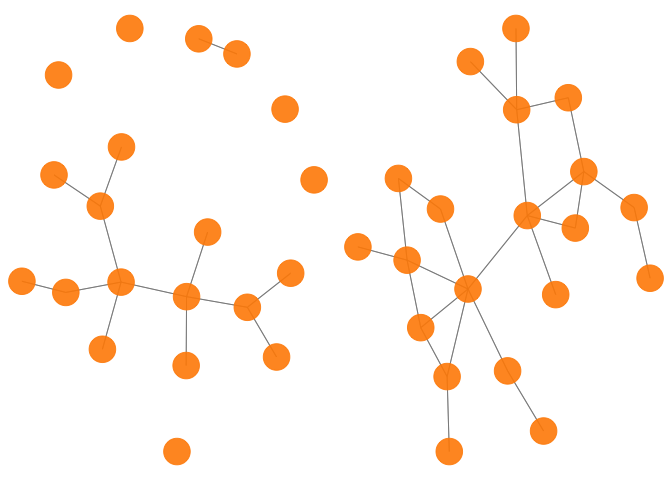

<!-- README.md is generated from README.Rmd. Please edit that file -->
<!-- badges: start -->
[](https://www.tidyverse.org/lifecycle/#experimental) [](https://codecov.io/gh/Camiling/JoStARS) [](https://opensource.org/licenses/MIT) [](https://github.com/Camiling/JoStARS/actions) <!-- badges: end -->

<!-- IF ON CRAN []
[]---->
<!--PAPER HERE []---->
# `JoStARS`

The `JoStARS` package implements JoStARS for sparsity and similarity selection in joint network reconstruction of multiple graphs, in the setting of Gaussian graphical models. JoStARS performs penalty parameter selection in the joint graphical lasso of Danaher, Wang, and Witten (2014), selecting both the sparsity controlling and the between-graph similarity controlling penalty parameters. The objective is to borrow strength across similar classes to increase statistical power, while ensuring that the joint modelling may not decrease the accuracy of the resulting inferred graphs. The method takes a list of data matrices for which separate graphs are to be inferred, and selects the penalty parameters with a data-driven approach. The sparsity controlling parameter is selected based on graph stability (Liu, Roeder, and Wasserman (2010)), while the similarity controlling parameter is selected with a likelihood-based approach (Foygel and Drton (2010)).

## Installation

To install the current development version, use

``` r
remotes::install_github("camiling/JoStARS")
```

If you would like to install all packages of the models we currently support, use

``` r
remotes::install_github("camiling/JoStARS", dependencies = TRUE)
```

If you would also like to build and view the vignette locally, use

``` r
remotes::install_github("camiling/JoStARS", dependencies = TRUE, build_vignettes = TRUE)
browseVignettes("JoStARS")
```

## Example

The main function `JoStARS` takes a list of *K* data matrices, each of dimension *n*<sub>*k*</sub> × *p* where *n*<sub>*k*</sub> is the sample size of *class* (or data set) *k*, for which separate graphs are to be inferred. The function uses JoStARS to select the sparsity controlling penalty parameter *λ*<sub>1</sub> and similarity controlling penalty parameter *λ*<sub>2</sub>, and uses the joint graphical lasso (Danaher, Wang, and Witten (2014)) to estimate the inverse covariance matrices (precision matrix) of each of the *K* classes. For each class, a graph structure can then be determined by letting there be an edge between all pairs of variables, or nodes, (*i*, *j*) whose corresponding element in the estimated precision matrix is non-zero.

The following examples show how `JoStARS` selects how strongly similarity should be enforced for a set of *K* = 2 graph, as well as determine the sparsity level, and returns the resulting precision matrix estimates. One example with *K* = 2 data sets drawn from the same distribution, and one with *K* = 2 data sets drawn from completely unrelated distributions, is shown. In the fist case, *λ*<sub>2</sub> is selected to be larger than zero, hence encouraging similarity. This results in high precision considering the high dimensionality of the problem. In the latter case, *λ*<sub>2</sub> is selected to be exactly zero and no similarity between the two graphs is encouraged.

The data is generated using the R package `huge` (Jiang et al. (2020)), as it includes functionality for generating data from a Gaussian graphical model. The networks we generate are *scale-free*, which is a known trait in many real-life networks such as genomic networks (Kolaczyk (2009)).

``` r
#  example 1: scale-free data where the data sets are from the same distribution
set.seed(123)
n1 <- 100 # let there be different number of samples in each data set
n2 <- 80
p <- 20
dat <- huge::huge.generator(n = n1, d = p, graph = "scale-free")
#> Generating data from the multivariate normal distribution with the scale-free graph structure....done.
dat$sparsity # true sparsity level
#> [1] 0.1
prec.mat <- dat$omega # the true precision matrix of both data sets
x1 <- MASS::mvrnorm(n1, mu = rep(0, p), Sigma = dat$sigma) # data set 1
x2 <- MASS::mvrnorm(n2, mu = rep(0, p), Sigma = dat$sigma) # data set 2
Y <- list(x1, x2)
res <- JoStARS(Y, lambda2.max = 0.3)
#> Tuning lambda1... 
#>  Tuning lambda2...
#> Tuning lambda2:  100  % done
adj.mat1 <- res$opt.fit[[1]] != 0 # the estimated adjacency matrix of graph 1
adj.mat2 <- res$opt.fit[[2]] != 0 # the estimated adjacency matrix of graph 2
res$opt.lambda1 # the optimal selected value of lambda1
#> [1] 0.3226316
res$opt.lambda2 # lambda2 is chosen quite large
#> [1] 0.06315789
res$opt.sparsities # the sparsities of the estimated precision matrices
#> [1] 0.06315789 0.07894737
# Look at precision of inferred graphs
precision(abs(prec.mat) > 1e-7, res$opt.fit[[1]] != 0)
#> [1] 1
precision(abs(prec.mat) > 1e-7, res$opt.fit[[2]] != 0)
#> [1] 0.8666667

# example 2. scale-free data where where the data sets are from completely unrelated distributions
set.seed(123)
n1 <- 100
n2 <- 80
p <- 20
dat1 <- huge::huge.generator(n = n1, d = p, graph = "scale-free")
#> Generating data from the multivariate normal distribution with the scale-free graph structure....done.
dat2 <- huge::huge.generator(n = n2, d = p, graph = "scale-free") # second graph is completely unrelated
#> Generating data from the multivariate normal distribution with the scale-free graph structure....done.
dat1$sparsity # true sparsity level for graph 1
#> [1] 0.1
dat2$sparsity # true sparsity level for graph 2
#> [1] 0.1
prec.mat1 <- dat1$omega # the true precision matrix of data set 1
prec.mat2 <- dat2$omega # the true precision matrix of data set 2
x1 <- MASS::mvrnorm(n1, mu = rep(0, p), Sigma = dat1$sigma)
x2 <- MASS::mvrnorm(n2, mu = rep(0, p), Sigma = dat2$sigma)
Y <- list(x1, x2)
res <- JoStARS(Y, scale = T, lambda2.max = 0.3)
#> Tuning lambda1... 
#>  Tuning lambda2...
#> Tuning lambda2:  100  % done
adj.mat1 <- res$opt.fit[[1]] != 0 # the estimated adjacency matrix of graph 1
adj.mat2 <- res$opt.fit[[2]] != 0 # the estimated adjacency matrix of graph 2
res$opt.lambda1 # the optimal selected value of lambda1
#> [1] 0.2705263
res$opt.lambda2 # lambda2 is chosen very small
#> [1] 0
res$opt.sparsities # the sparsities of the estimated precision matrices
#> [1] 0.07894737 0.12105263
# lower precision as no information could be borrowed across classes
precision(abs(prec.mat1) > 1e-7, adj.mat1 != 0)
#> [1] 0.9333333
precision(abs(prec.mat2) > 1e-7, adj.mat2 != 0)
#> [1] 0.6956522
```

The resulting JoStARS graphs can be visualised with functions from the `network` and `ggnet2` libraries.

``` r
set.seed(1234)
net1 <- network::network(adj.mat1)
net2 <- network::network(adj.mat2)
g1 <- GGally::ggnet2(net1, alpha = 0.9, color = "deepskyblue2")
#> Registered S3 method overwritten by 'GGally':
#>   method from   
#>   +.gg   ggplot2
g2 <- GGally::ggnet2(net2, alpha = 0.9, color = "deepskyblue2")
ggpubr::ggarrange(g1, g2, ncol = 2, nrow = 1)
```



## Contribution

All feedback and suggestions are very welcome. If you have any questions or comments, feel free to open an issue [here](https://github.com/Camiling/JoStARS/issues).

## References

Danaher, Patrick, Pei Wang, and Daniela M Witten. 2014. “The Joint Graphical Lasso for Inverse Covariance Estimation Across Multiple Classes.” *Journal of the Royal Statistical Society: Series B (Statistical Methodology)* 76 (2). Wiley Online Library: 373–97.

Foygel, Rina, and Mathias Drton. 2010. “Extended Bayesian Information Criteria for Gaussian Graphical Models.” In *Advances in Neural Information Processing Systems*, 604–12.

Jiang, Haoming, Xinyu Fei, Han Liu, Kathryn Roeder, John Lafferty, Larry Wasserman, Xingguo Li, and Tuo Zhao. 2020. *Huge: High-Dimensional Undirected Graph Estimation*. <https://CRAN.R-project.org/package=huge>.

Kolaczyk, Eric D. 2009. *Statistical Analysis of Network Data: Methods and Models*. Springer Science & Business Media.

Liu, Han, Kathryn Roeder, and Larry Wasserman. 2010. “Stability Approach to Regularization Selection (Stars) for High Dimensional Graphical Models.” In *Advances in Neural Information Processing Systems*, 1432–40.
